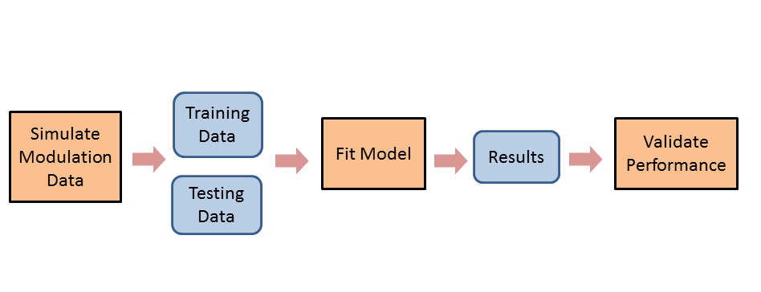
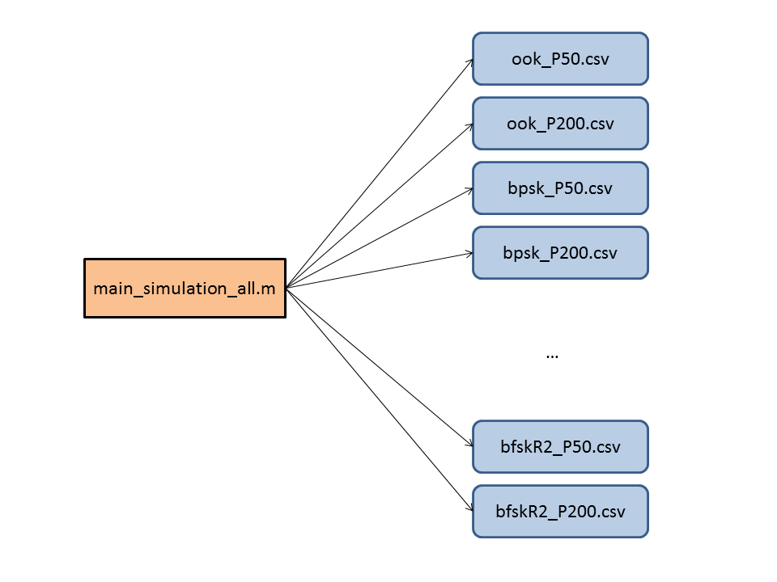
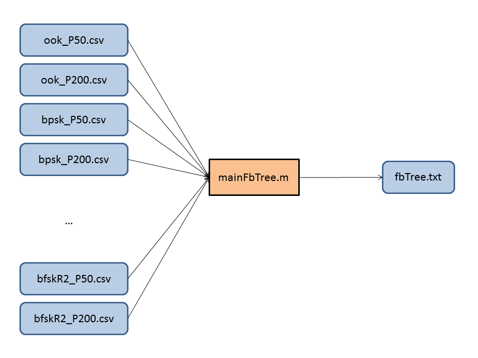
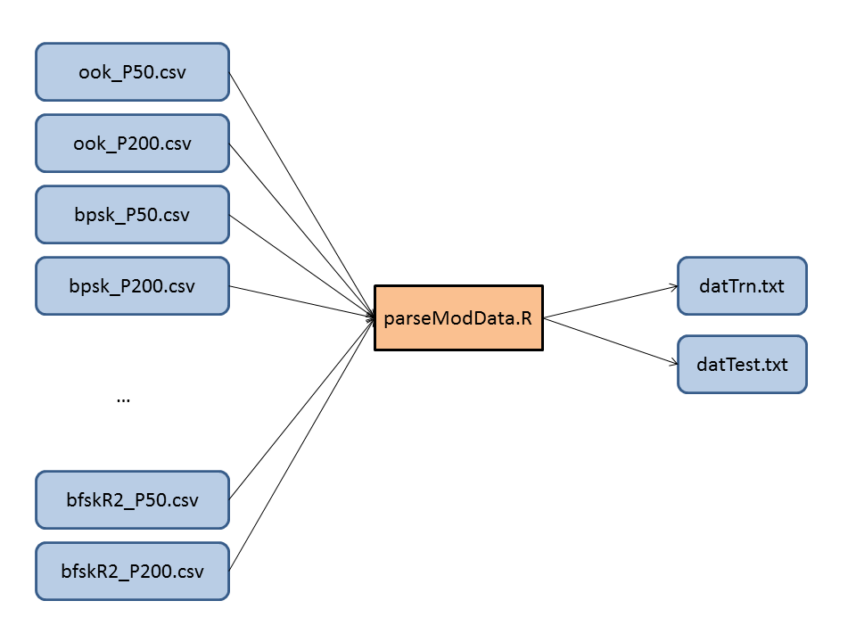
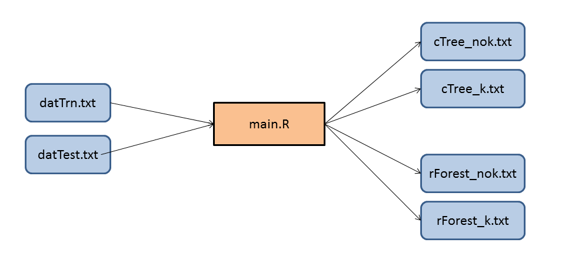

## Modulation Recognition in the 868 MHz Band using Classification Trees and Random Forests

**M.Sc. Project**

**Ken Lau**

**Supervisors: Matías Salibián-Barrera and Lutz Lampe**

**UBC**

This README file guides us through the workflow of our study. The workflow consists of 3 major components. First, modulation data is generated through MATLAB to obtain training and testing data. Next, models are fitted on the training data, and then predicted with the testing data. The models include feature-based tree (fbTree), classification tree (cTree) and random forest (rForest). Finally, predicitive performance is validated for each model.

This guide is complementary to the paper (to be posted later). 

Big Picture:

#### Simulating Modulation Data
The code that performs the simulation is in ["code/Modulation"](https://github.com/kenlau177/MSC_Project/tree/master/code/Modulation).

In particular, ["code/Modulation/main_simulation_all.m"](https://github.com/kenlau177/MSC_Project/blob/master/code/Modulation/main_simulation_all.m) script is automated to simulate the modulation data. Note that MATLAB's Communication Toolbox is required.

Data is output to ["data/Modulation"](https://github.com/kenlau177/MSC_Project/tree/master/data/Modulation). 

There are 6 modulation types: ook, bpsk, oqpsk, bfksA, bfskB, bfskR2. Refer to the paper for more details. In the paper, P=50 corresponds to the training data and P=200 corresponds to the testing data.

#### Fit Feature-Based Tree
Run ["code/Train/fbTree/mainFbTree.m"](https://github.com/kenlau177/MSC_Project/blob/master/code/Train/fbTree/mainFbTree.m) to fit the fbTree.

Depends on several functions. They can be found in: ["code/Train/fbTree"](https://github.com/kenlau177/MSC_Project/blob/master/code/Train/fbTree)

Input: 
- Raw modulation data directly from the output of the previous step.

Output: 
- A text file with the predicted versus true modulation type as a function of SNR.
  * The first column corresponds to the SNR
  * The second column is the true modulation type
  * The third column is the predicted modulation type
  * Stored in ["data/Fitted/fbTree"]("https://github.com/kenlau177/MSC_Project/blob/master/data/Fitted/fbTree")

#### Combine Modulation Data
We combine the corresponding training data from each raw modulation data with P=50. The same is done for the testing data with P=200. We should end up with training data containing all modulations. Similarly for the testing data. The purpose of this step is to simplify the inputs before fitting the models.

Essentially, we could have the combined training and testing data for fitting the fbTree. However, it is easier to use the raw modulation data in MATLAB. Therefore, the raw modulation data was used for the fbTree and the combined training/testing data was used for the cTree and rForest. 

Run ["code/Train/parseModData.R"](https://github.com/kenlau177/MSC_Project/blob/master/code/Train/parseModData.R) to combine the raw modulation data.

Input:
- raw modulation data based on the output from Section on Simulating Modulation Data

Output:
- combined training and testing data
 * ["data/datTrn.txt"](https://github.com/kenlau177/MSC_Project/blob/master/data/datTrn.txt)
 * ["data/datTest.txt"](https://github.com/kenlau177/MSC_Project/blob/master/data/datTest.txt)

#### Fit Classification Tree and Random Forest
Based on the paper, we consider fitting the models under 2 analysis scenarios. In the first scenario, we use only features m1,...,m5. In the second scenario we use all the features. 

Run ["code/Train/main.R"](https://github.com/kenlau177/MSC_Project/blob/master/code/Train/main.R) to fit the cTree and rForest.

Depends on cTree.R, rForest.R, and procedure.R. They can be found in: ["code/Train"](https://github.com/kenlau177/MSC_Project/blob/master/code/Train)

Input: 
- combined training and testing data

Output: 
- Text files with the predicted versus true modulation type as a function of SNR.
  * If the file name contains 'k', then that means all features were used.
  * Otherwise, if the file name contains 'nok', then that means only m1,...,m5 were used.
  * The first column corresponds to the SNR
  * The second column is the true modulation type
  * The third column is the predicted modulation type
  * cTree: ["data/Fitted/cTree"]("https://github.com/kenlau177/MSC_Project/blob/master/data/Fitted/cTree")
  * rForest: ["data/Fitted/rForest"]("https://github.com/kenlau177/MSC_Project/blob/master/data/Fitted/rForest")

#### Validating Predictive Performance

